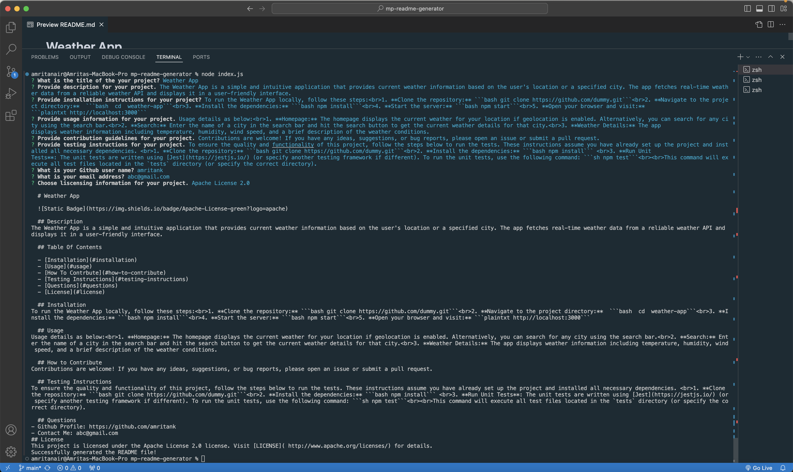
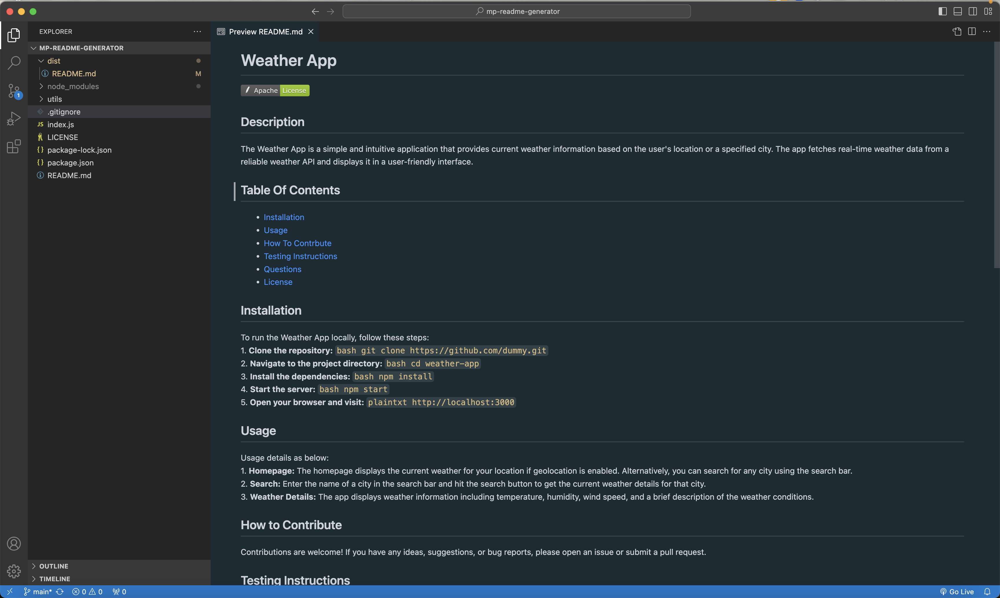

  # ReadeMe Generator 

   

  ## Description
This command line tool, inquires a list of questions from the user and dynamically constructs a README file with the inputs provides. The generated README file is saved under the ```./dist``` folder. See below images on how to use the tool and the generated README.<br><br> 

  ## Table Of Contents

  - [Installation](#installation)
  - [Usage](#usage)
  - [How To Contrbute](#how-to-contribute)
  - [Testing Instructions](#testing-instructions)
  - [Questions](#questions)
  - [License](#license)

  ## Installation
To run the tool locally, follow these steps: <br>1. **Clone the repository:** ```bash git clone git@github.com:amritank/mp-readme-generator.git```<br> 3. **Navigate to the project directory:** ```bash cd mp-readme-generator```<br>3. **Install the dependencies:** ```bash npm install```<br>4. **Run the tool:** ```bash node index.js```<br><br>The tool presumes you have node.js installed. 

  ## Usage
Run ```bash node index.js``` and answer the questions prompted on the screen to dynamically generate a README on the fly. 

  ## How to Contribute
N/A 

  ## Testing Instructions
No testing done for this project. 

  ## Questions
## License
This project is licensed under the MIT License license. Visit [LICENSE](https://www.tldrlegal.com/license/mit-license) for details.